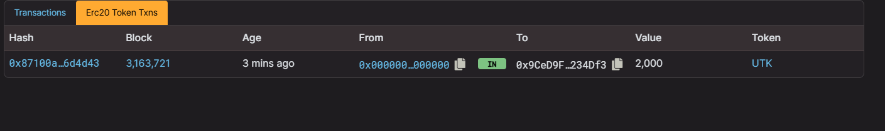

# ERC20TokenProject

## Overview
The **AITU_Nurassyl_SE-2327_Token (UTK)** is a custom ERC-20 token implemented using the OpenZeppelin library. It features basic ERC-20 functionality along with custom methods for retrieving transaction details. The contract is deployed on the Holesky Ethereum testnet.

## Features
- Initial token supply: **2000 UTK**.
- Implements ERC-20 standard for compatibility with wallets and exchanges.
- Additional functionality:
  - Retrieve the sender, receiver, and timestamp of the latest transaction.
  - Timestamp in a human-readable format.
- Deployment on the Holesky Ethereum testnet using Hardhat and MetaMask.

## Usage

### Prerequisites
1. Install Node.js and npm.
2. Install Hardhat:
   ```bash
   npm install --save-dev hardhat
   ```
3. Install dependencies:
   ```bash
   npm install dotenv @openzeppelin/contracts web3
   ```
4. Configure your MetaMask wallet with the Holesky Ethereum testnet.

### Deployment Steps
1. Clone this repository:
   ```bash
   git clone https://github.com/nur1kesh/ERC20TokenProject.git
   ```
2. Compile the smart contract:
   ```bash
   npx hardhat compile
   ```
3. Deploy the contract:
   ```bash
   npx hardhat run deploy.js --network holesky
   ```
4. Note the contract address displayed in the terminal.

### Interacting with the Token
1. Use the contract address and ABI to interact with the deployed token via tools like Etherscan or Web3.js.
2. Transfer tokens, retrieve transaction details, or check balances using the provided functions.

## Screenshot
Below is a screenshot of a successful token transfer on the Holesky Ethereum testnet:



## Examples

### Checking Token Balance
Use the following Web3.js snippet to check the balance of a specific address:

```javascript
const Web3 = require('web3');
const web3 = new Web3('<Holesky_RPC_URL>');

const contract = new web3.eth.Contract(abi, '<Contract_Address>');

async function getBalance(address) {
  const balance = await contract.methods.balanceOf(address).call();
  console.log(`Balance: ${web3.utils.fromWei(balance, 'ether')} UTK`);
}

getBalance('<Wallet_Address>');
```

### Retrieving Last Transaction Details
```javascript
async function getLastTransactionDetails() {
  const lastSender = await contract.methods.getLastTransactionSender().call();
  const lastReceiver = await contract.methods.getLastTransactionReceiver().call();
  const lastTimestamp = await contract.methods.getLastTransactionTimestamp().call();

  console.log(`Sender: ${lastSender}`);
  console.log(`Receiver: ${lastReceiver}`);
  console.log(`Timestamp: ${lastTimestamp}`);
}

getLastTransactionDetails();
```

### Transferring Tokens
```javascript
async function transferTokens(sender, privateKey, recipient, amount) {
  const account = web3.eth.accounts.privateKeyToAccount(privateKey);
  web3.eth.accounts.wallet.add(account);

  const tx = contract.methods.transfer(recipient, web3.utils.toWei(amount, 'ether'));
  const gas = await tx.estimateGas({ from: sender });

  const receipt = await tx.send({ from: sender, gas });
  console.log('Transaction successful:', receipt.transactionHash);
}

transferTokens('<Sender_Address>', '<Private_Key>', '<Recipient_Address>', '10');
```

---

### AITU_Nurassyl.sol

```solidity
// SPDX-License-Identifier: MIT
pragma solidity ^0.8.0;

import "@openzeppelin/contracts/token/ERC20/ERC20.sol";

contract AITU_Nurassyl is ERC20 {
    event TransactionInfo(
        address indexed sender,
        address indexed receiver,
        uint256 amount,
        uint256 timestamp
    );

    address private lastSender;
    address private lastReceiver;
    uint256 private lastTimestamp;

    constructor() ERC20("AITU_Nurassyl_SE-2327_Token", "UTK") {
        _mint(msg.sender, 2000 * 10 ** decimals());
    }

    function transfer(address recipient, uint256 amount)
        public
        override
        returns (bool)
    {
        bool success = super.transfer(recipient, amount);

        if (success) {
            lastSender = msg.sender;
            lastReceiver = recipient;
            lastTimestamp = block.timestamp;

            emit TransactionInfo(msg.sender, recipient, amount, block.timestamp);
        }

        return success;
    }

    function getLastTransactionTimestamp() public view returns (string memory) {
        uint256 ts = lastTimestamp;
        return _convertTimestampToReadableFormat(ts);
    }

    function getLastTransactionSender() public view returns (address) {
        return lastSender;
    }

    function getLastTransactionReceiver() public view returns (address) {
        return lastReceiver;
    }

    function _convertTimestampToReadableFormat(uint256 timestamp)
        internal
        pure
        returns (string memory)
    {
        return string(abi.encodePacked("Timestamp: ", uint2str(timestamp)));
    }

    function uint2str(uint256 _i) internal pure returns (string memory) {
        if (_i == 0) {
            return "0";
        }
        uint256 j = _i;
        uint256 len;
        while (j != 0) {
            len++;
            j /= 10;
        }
        bytes memory bstr = new bytes(len);
        uint256 k = len - 1;
        while (_i != 0) {
            bstr[k--] = bytes1(uint8(48 + (_i % 10)));
            _i /= 10;
        }
        return string(bstr);
    }
}
```
---

## License

This project is licensed under the MIT License - see the [LICENSE](./LICENSE) file for details.